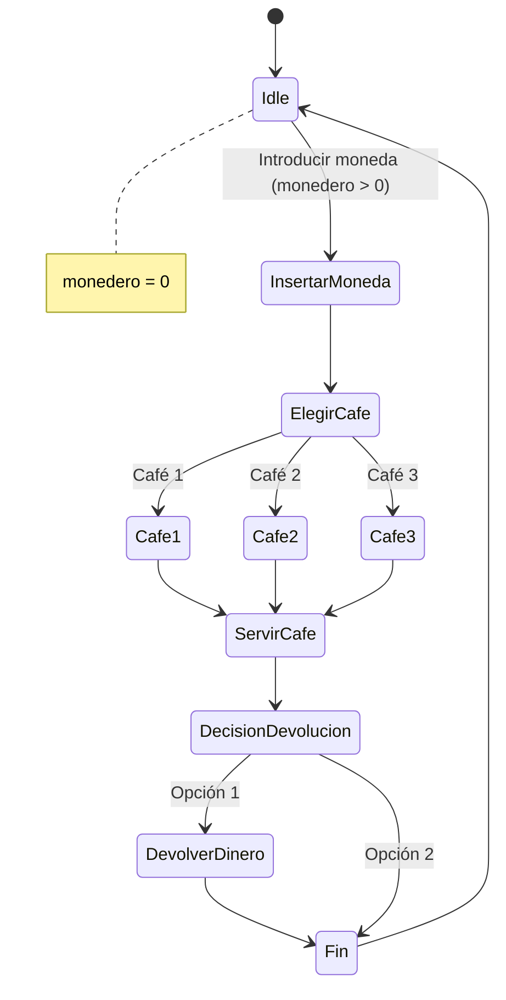

# Máquina de café

```mermaid
stateDiagram-v2
    [*] --> Idle
    note right of Idle: monedero = 0

    Idle --> InsertarMoneda: Introducir moneda (monedero > 0)
    InsertarMoneda --> ElegirCafe

    state ElegirCafe <<choice>>
    ElegirCafe --> Cafe1: Café 1
    ElegirCafe --> Cafe2: Café 2
    ElegirCafe --> Cafe3: Café 3

    Cafe1 --> ServirCafe
    Cafe2 --> ServirCafe
    Cafe3 --> ServirCafe

    ServirCafe --> DecisionDevolucion
    state DecisionDevolucion <<choice>>
    DecisionDevolucion --> DevolverDinero: Opción 1
    DevolverDinero --> Fin
    DecisionDevolucion --> Fin: Opción 2

    Fin --> Idle
```
